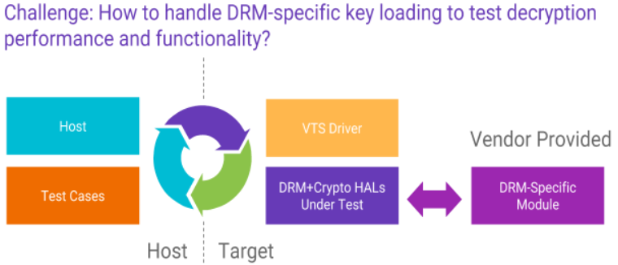

# DRM/Crypto vendor-specific VTS modules

Version 1.0

© 2017 Google, Inc. All Rights Reserved. No express or implied warranties are provided for herein. All specifications are subject to change and any expected future products, features or functionality will be provided on an if and when available basis. Note that the descriptions of Google’s patents and other intellectual property herein are intended to provide illustrative, non-exhaustive examples of some of the areas to which the patents and applications are currently believed to pertain, and is not intended for use in a legal proceeding to interpret or limit the scope or meaning of the patents or their claims, or indicate that a Google patent claim(s) is materially required to perform or implement any of the listed items.

This document describes DRM vendor-specific modules that support VTS testing of the DRM and Crypto HIDL HALs.

## Rationale

The DRM and Crypto HALs interact with vendor-provided HAL implementations that have DRM-specific capabilities. Since the VTS tests cannot contain DRM-specific functionality, supporting modules are required to enable VTS to validate HAL implementations in a generic way. If the vendor-specific VTS module is not provided for a given drm HAL implementation, only very small subset of functionality can be verified.

As an example, a DRM HAL implementation interacts with a DRM-specific license server to obtain licenses for decrypting content. The DRM HAL implementation generates a key request message, delivers it to the server and receives a key response message which is then loaded into the HAL. Once the keys are loaded, the Crypto HAL decryption functionality and performance and other associated APIs can be tested by the common VTS test suite, as shown in the following diagram.

## The vendor-specific VTS module

Vendor-specific VTS modules are shared libraries used by the DRM VTS test. They provide a set of functions to support VTS testing of the DRM HAL module.
The modules are placed in a common location on the file system. The VTS test scans through all vendor-provided support libraries and runs the VTS test suite on each library that is found.
The vendor-specific module exposes an extern “C” vendorModuleFactory() function that returns a DrmHalVTSVendorModule instance. DrmHalVTSVendorModule instances are versioned, where each version is represented by subclass of DrmHalVTSVendorModule that corresponds to the API version. For example, a vendor-specific module that implements version 1 of the API would return a DrmHalVTSVendorModule_V1 from the vendorModuleFactory() function.

The methods that need to be provided are:

* getAPIVersion - Report the version of the module API. Versions are integer values
starting from 1.

* getUUID - To instantiate a DRM plugin, the Protection System Specific UUID for the
plugin must be known. Once the UUID is known, the DRM plugin can be instantiated
using the DrmFactory HIDL HAL.

The API Version 1 (class DrmHalVTSVendorModule_V1) methods are:

* handleProvisioningRequest - Accept a provision request and generate a provisioning
response. This can either be done by implementing a mock of a provisioning server or
interacting with a real one.

* getContentConfigurations - Return a list of test content descriptors. The content
descriptors enable the VTS test to request and load keys to execute test vectors. A
content configuration descriptor contains the server URL, initialization data, mime type,
key ids and optional parameters necessary to make a key request so decryption
operations can be performed using the keys contained in the key response. Additionally
the content configuration contains a flag indicating whether the content requires secure
buffers to be used. At least one non-secure content configuration should be provided,
which allows the VTS to execute some test vectors where the decryption results can be
verified.

* handleKeyRequest - Accept a key request and provide a key response. This can either
be done by implementing a mock of a license server or interacting with a real license
server. handleKeyRequest is provided with the serverUrl from the content configuration
and the key request opaque object returned from getKeyRequest.
